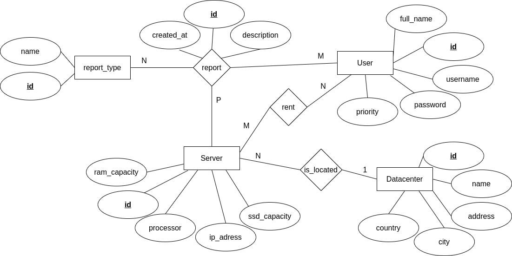

# Hosting Panel

## O projektu

Hosting panel omogućava korisnicima koji koriste usluge hostinga da na jednostavni način "zakupe" server hostinga kao i da dodaju report (vrsta usluge kojima korisnik obaveštava hosting na probleme na koje je naišao)

## Funkcionalnost web aplikacije

- Postoje dve vrste korisnika: korisnik usluga i admin

- Korisnik usluga može da zakupi server

- Korisnik usluga može da dostavi izveštaj/report hostingu i na taj način obavesti o problemima na istom. Takođe, report može da izbriše i izmeni

- Admin može dodavati, brisati, menjati servere, kao i da obriše iste

- Admin takođe može report da označi kao rešen (podrazumevano je da nije rešen)

- Admin grafičkim prikazom ima uvid u broj problema na osnovu tipa problema/reporta

## Izgled ER dijagrama baze podataka

## Izgled grafičkog interfejsa web aplikacije

