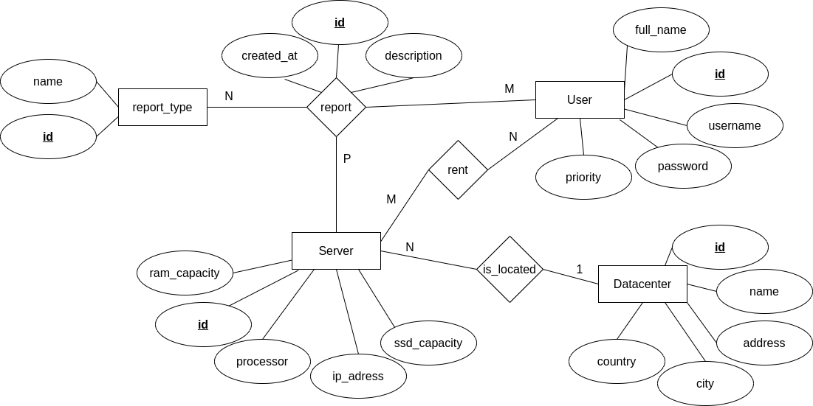

# Hosting Panel

## O projektu

Hosting panel omogućava korisnicima koji koriste usluge hostinga na jednostavni način "zakupe" server hostinga kao i da naprave report-ova (vrsta usluge kojima korisnik obaveštava hosting na probleme na koje je naišao)

## Funkcionalnost web aplikacije

- Postoje dve vrste korisnika: korisnik usluga i admin

- Korisnik usluga može da zakupi server birajući datacentar i na osnovu datacentra bira server koji želi

- Korisnik usluga može da dostavi izveštaj/report hostingu i na taj način obavesti o problemima na istom, kao i da isti izbriše i izmeni

- Admin može dodavati, brisati, menjati datacentre i servere za određeni datacentar

- Admin grafičkim prikazom ima uvid u statistiku problema za svaki datacentar (izlistani svi serveri sa brojem prijava/problema) kao i broj problema na osnovu tipa problema/reporta

## Izgled ER dijagrama baze podataka

## Izgled grafičkog interfejsa web aplikacije

